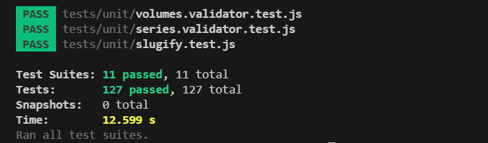
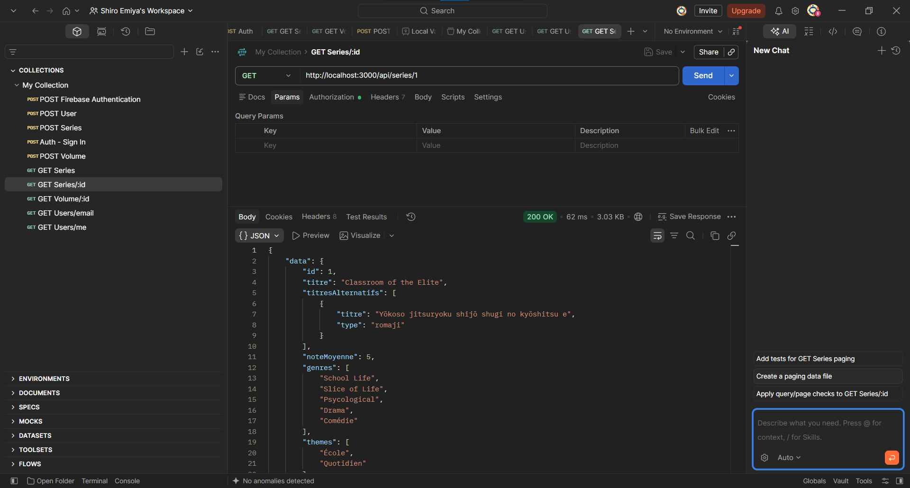
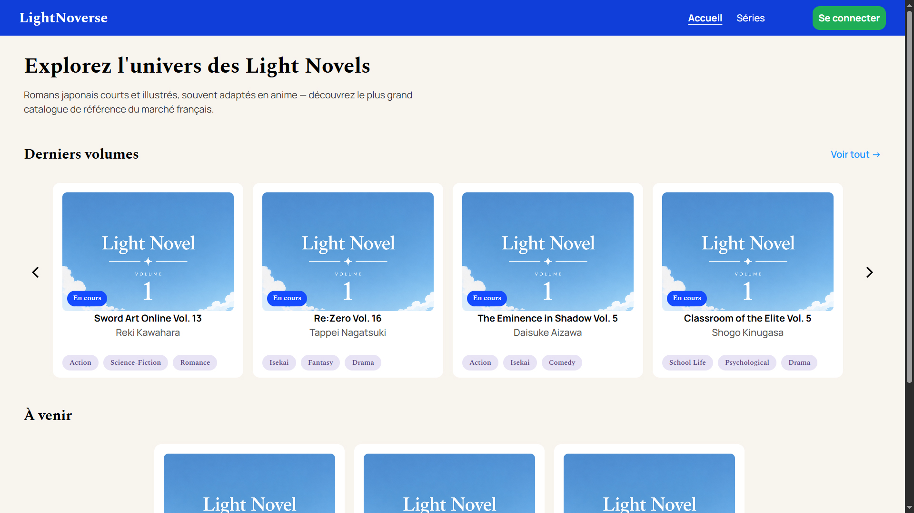
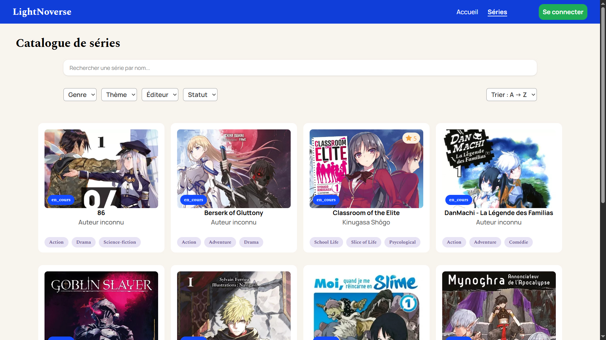
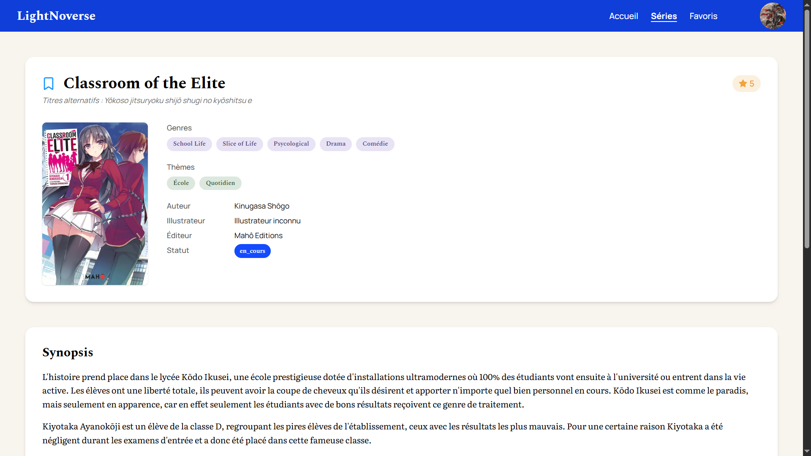

# Light Noverse

**Light Noverse** est une application web full-stack cataloguant les séries de Light Novels disponibles sur le marché français. Le projet a pour objectif de donner une meilleure visibilité publique à ces œuvres, encore peu référencées de manière centralisée.

## Fonctionnalités principales implémentées

- Parcours du catalogue
- Fiches détaillées par série
- Système de comptes utilisateurs (Firebase Authentication)

## Fonctionnalités à venir

- Filtrage du catalogue (genres, thèmes, auteurs, éditeurs)
- Fiches détaillées par volume
- Notes et commentaires sur les séries et les volumes
- Gestion de favoris
- Interface d'administration pour la gestion du catalogue
- Enrichissement automatique des fiches via l'API Google Books

## Membres

- Thyyd : Responsable du projet, de la partie conception à la partie réalisation. Chargé de développer le Front-End et la Back-End en passant par la gestion de la base de données et des services externes (Cloudinary, Firabase Authentication, etc...)

## Stack technique

| Domaine | Technologies |
|---|---|
| Frontend | React (JavaScript), Vite, Tailwind CSS v4 |
| Backend | Node.js, Express |
| Base de données | PostgreSQL, Prisma 6 |
| Authentification | Firebase Authentication |
| Stockage d'images | Cloudinary |
| API externe | Google Books API |
| Environnement de dev | Docker Compose |
| Tests | Jest, React Testing Library, Supertest |

## Structure du projet

```
Light-Novel-Project/
├── FrontEnd/           # Application React
├── BackEnd/            # API REST Express + Prisma
├── docs/               # Spécifications, diagrammes, documentation
├── docker-compose.yml  # PostgreSQL (dev + test)
└── .gitignore
```

## Prérequis

- Node.js ≥ 20
- Docker et Docker Compose
- Un compte Firebase (Authentication)
- Un compte Cloudinary

## Installation

1. Cloner le repo
   ```bash
   git clone https://github.com/Thyyd/Light-Novel-Project
   cd Light-Novel-Project
   ```

2. Démarrer les bases de données PostgreSQL (dev + test)
   ```bash
   docker compose up -d
   ```

3. Installer et configurer le backend
   ```bash
   cd BackEnd
   npm install
   cp .env.example .env
   # Renseigner les variables d'environnement dans .env
   npm run prisma:generate
   npm run prisma:migrate
   npm run dev
   ```

4. Installer et configurer le frontend
   ```bash
   cd FrontEnd
   npm install
   cp .env.example .env
   # Renseigner les variables d'environnement dans .env
   npm run dev
   ```

## Documentation

L'ensemble de la documentation du projet (user stories, documentation API, diagrammes ERD/UML, maquettes) est disponible dans [Docs/](Docs/README.md).

## Tests

### Stratégie de test

- **Tests unitaires** (Jest) : fonctions utilitaires isolées (ex. `slugify.js`)
- **Tests d'intégration** (Jest + Supertest) : routes de l'API, sur une base PostgreSQL de test dédiée (Docker), sans mock de Prisma
- **Services externes mockés** : Firebase Auth, Cloudinary, Google Books API (`jest.mock`)
- **Tests manuels** : Postman, pour les flux impliquant des services externes (upload d'image, authentification) et pour tester les endpoints de l'API.
- **Tests manuels Front-End** : `npm run dev` avec la console des DevTools, afin de vérifier qu'il n'y ait pas de warnings et pour vérifier le comportement sous Mobile.
- **E2E** : hors périmètre, remplacé par les tests manuels structurés ci-dessus

### Exécution des tests

```bash
cd BackEnd
npm test
```

### Résultats




## Bugs et problèmes connus

Bugs rencontrés lors des tests manuels, tous corrigés à ce jour :

| Bug | Statut |
|---|---|
| **Ajout d'un volume 0 impossible** : À cause d'une mauvaise condition dans le validator pour ajouter un volume (condition `.positive`), le numéro du volume ne pouvait être 0 ; alors que des volumes 0 peuvent exister en tant que préquel à une histoire (comme Classroom of the Elite par exemple. Ce volume devrait parraître d'ici quelques temps en France). Après une modification de cette condition par un `.min(0)`, ce problème a été résolu. | ✅ Corrigé |
| **Lien des cards vers la série cassé** : À cause d'un oubli d'ajout d'un props à mes Cards, le lien vers lequel elles renvoyaient était `/series/undefined` au lieu de `/series/:id`. Après correction et l'ajout de l'id aux props, ce lien est redevenu fonctionnel. | ✅ Corrigé |
| **npm test fonctionnel individuellement, mais qui échouait avec l'appel "groupé"** : Les tests tournaient sans soucis individuellement, mais quand on utilisait le scipt `npm test`, les tests d'intégration échouaient, car ils entraient en conflits car ils étaient déclenchés tous en même temps, et pas l'un après l'autre. Après l'ajout du paramètre `--runInBand` dans le script de test (BackEnd/package.json), ce problème a été résolu. | ✅ Corrigé |

## Démonstration

Captures d'écran des pages principales actuellement implémentées :

### Homepage


### Catalogue des séries


### Fiche détaillée d'une série


## Workflow Git

- `main` : version stable, utilisée pour les démonstrations
- `develop` : branche d'intégration des fonctionnalités terminées
- `feature/xxx` : une branche par fonctionnalité
- `fix/xxx` : une branche par correctif

## Auteur

Développé par Thyyd.